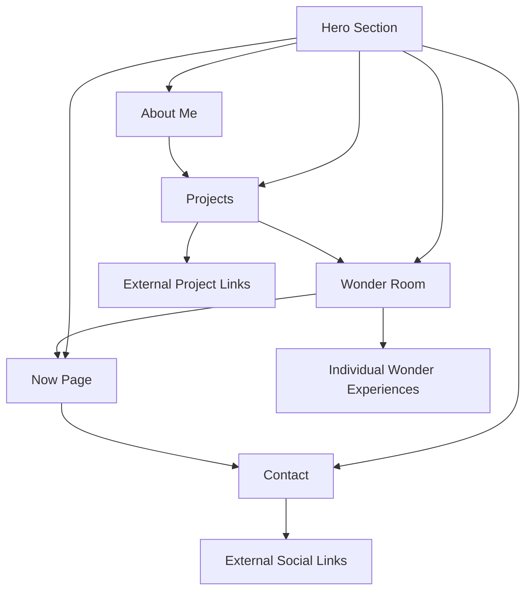

# Kiezz Portfolio Website - Product Requirements Document

## 1. Product Overview

A modern, interactive portfolio website for Kiezz (Ahmad Zuhairy), showcasing development skills through a unique blend of professional work and creative experiments. The site features a mind-bending "Wonder Room" section with impossible geometries and optical illusions that demonstrate technical prowess while entertaining visitors.

The portfolio targets potential employers, clients, and fellow developers, positioning Kiezz as a skilled full-stack developer with creative flair and attention to detail.

## 2. Core Features

### 2.1 User Roles

No role distinction necessary - single public-facing portfolio site accessible to all visitors.

### 2.2 Feature Module

Our portfolio consists of the following main pages:

1. **Home page**: hero section with typing animation, navigation menu, smooth scrolling to sections
2. **About section**: personal bio, skills showcase, professional experience, downloadable resume
3. **Projects section**: featured project gallery, project details with live demos and GitHub links
4. **Wonder Room section**: interactive 3D experiences with impossible geometries and optical illusions
5. **Now page**: current work status, side projects, real-time activity widget
6. **Contact section**: contact form, social media links, professional email

### 2.3 Page Details

| Page Name           | Module Name               | Feature description                                                                                                                                                                                                                   |
| ------------------- | ------------------------- | ------------------------------------------------------------------------------------------------------------------------------------------------------------------------------------------------------------------------------------- |
| Home page           | Hero section              | Display name "Kiezz" with typing animation cycling through developer/meme generator/chaos engineer/cookie enthusiast/problem solver. Include headline "Serious code with a silly twist" and CTAs for View My Work and Download Resume |
| Home page           | Navigation menu           | Sticky navigation with smooth scroll to sections, theme toggle (dark/light mode), responsive hamburger menu for mobile                                                                                                                |
| About section       | Personal bio              | Display casual yet professional bio highlighting work at UTeM, personal projects, and coding philosophy with personality                                                                                                              |
| About section       | Skills showcase           | Interactive display of frontend (React, Next.js, Tailwind), backend (ASP.NET, Node.js), database (SQL Server, MySQL), and tools (Git, VS Code) with visual indicators                                                                 |
| About section       | Resume download           | One-click PDF download of professional resume with tracking analytics                                                                                                                                                                 |
| Projects section    | Featured gallery          | Showcase 4 main projects (Kira finance tracker, Solaris 3D solar system, Retro Desktop, Langton's Ant) with hover effects, live demo links, and GitHub repositories                                                                   |
| Projects section    | Project details           | Expandable cards showing tech stack, key features, development status, and case study information with screenshots                                                                                                                    |
| Wonder Room section | Infinite Mirror Maze      | Interactive 3D maze with endless reflections, mouse-controlled perspective, hidden pathways, and cursor light trails                                                                                                                  |
| Wonder Room section | Penrose Stairs            | Clickable impossible staircase with infinite loop, smooth camera transitions, and ambient audio                                                                                                                                       |
| Wonder Room section | Gravity-Defying Particles | Mouse-responsive particle system with impossible physics, interactive gravity wells, and color-shifting effects                                                                                                                       |
| Wonder Room section | Morphing Objects          | 3D impossible shapes (Penrose triangles, paradox cubes) with smooth transformations and rotation controls                                                                                                                             |
| Wonder Room section | Perspective Paradox       | Forced perspective illusions with rooms larger inside than outside, interactive viewpoint shifts                                                                                                                                      |
| Wonder Room section | Fractal Zoom Portal       | Infinite mathematical zoom with real-time generation, multiple fractal types, and shifting color palettes                                                                                                                             |
| Wonder Room section | Impossible Water Flow     | Upward-flowing water simulation with particle physics and soothing audio                                                                                                                                                              |
| Wonder Room section | Shadow Play Paradox       | Objects casting impossible shadows with multiple light sources and interactive manipulation                                                                                                                                           |
| Now page            | Activity widget           | Real-time display of current work at UTeM, active side projects, GitHub activity, and coding status                                                                                                                                   |
| Now page            | Music integration         | "Now Playing" widget showing current music or coding facts when idle                                                                                                                                                                  |
| Contact section     | Contact form              | Functional contact form with validation, spam protection, and email delivery                                                                                                                                                          |
| Contact section     | Social links              | Links to GitHub (Cookiez04), Instagram (@ki3zzy), and professional email (<kiezzyee@gmail.com>)                                                                                                                                       |

## 3. Core Process

Visitors land on the hero section and can navigate through the portfolio in any order. The typical flow involves:

1. Hero section introduces Kiezz with animated typing and clear CTAs
2. About section provides background and skills overview
3. Projects section showcases technical capabilities through real work
4. Wonder Room demonstrates creative coding and visual effects mastery
5. Now page shows current activity and personality
6. Contact section enables professional outreach

## 4. User Interface Design

### 4.1 Design Style

* **Primary colors**: Deep black (#000000) background, hot pink (#FF1B8D) and electric red (#FF0040) accents

* **Secondary colors**: Dark gray (#1A1A1A), white (#FFFFFF), light gray (#E5E5E5)

* **Button style**: Rounded corners with glow effects on hover, smooth color transitions

* **Fonts**: Inter for headings and body text, JetBrains Mono for code elements

* **Layout style**: Dark mode default with clean card-based sections, generous white space

* **Icons**: Minimalist geometric style with subtle animations, custom cookie mascot appearances

### 4.2 Page Design Overview

| Page Name           | Module Name     | UI Elements                                                                                                                                 |
| ------------------- | --------------- | ------------------------------------------------------------------------------------------------------------------------------------------- |
| Hero section        | Main display    | Large typography with gradient text effects, animated typing cursor, floating geometric background patterns, prominent CTAs with hover glow |
| About section       | Bio display     | Clean typography with highlighted keywords, skill bars with animated progress, professional headshot or mascot avatar                       |
| Projects section    | Project cards   | Hover-lift effects with shadow increase, gradient borders, thumbnail images, tech stack badges, status indicators                           |
| Wonder Room section | 3D canvas       | Full-screen WebGL rendering, smooth camera controls, particle effects, impossible lighting, ambient audio controls                          |
| Now page            | Activity widget | Terminal-style display with monospace font, real-time updates, subtle animations, music visualization                                       |
| Contact section     | Form design     | Clean input fields with focus states, validation feedback, social media icons with hover effects                                            |

### 4.3 Responsiveness

Mobile-first responsive design with specific breakpoints:

* Mobile (320px-768px): Touch-optimized interactions, simplified Wonder Room experiences

* Tablet (768px-1024px): Adjusted layouts with maintained functionality

* Desktop (1024px+): Full feature set with enhanced visual effects

* Large Desktop (1440px+): Expanded spacing and enhanced particle systems

