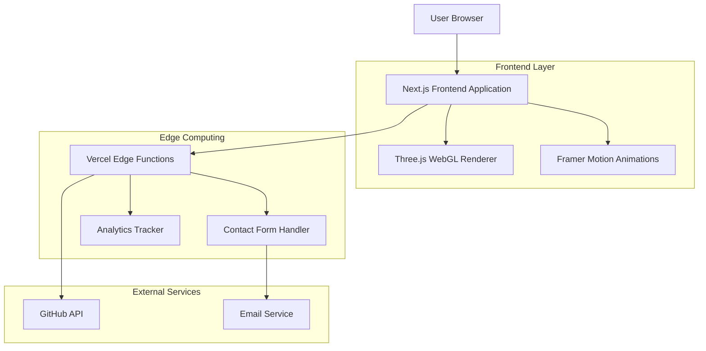
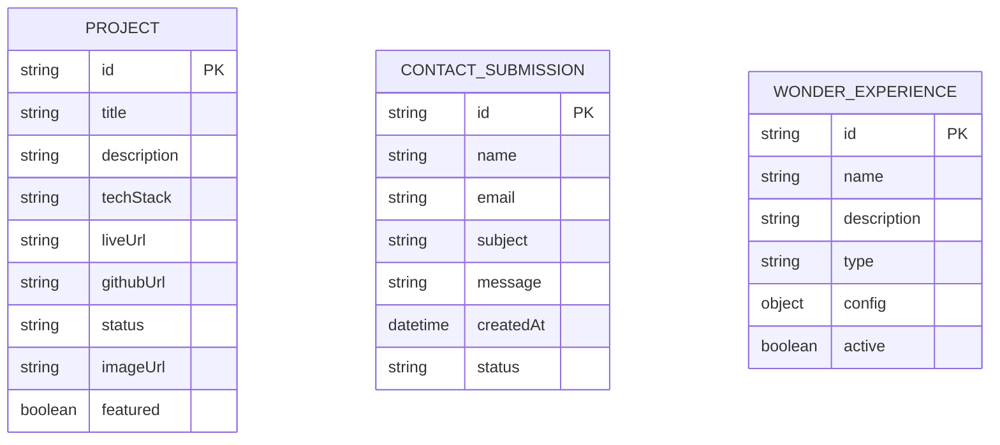

# Kiezz Portfolio Website - Technical Architecture Document

## 1. Architecture design



## 2. Technology Description

* Frontend: Next.js\@14 + React\@18 + TypeScript + Tailwind CSS\@3 + Framer Motion + Three.js + WebGL

* Deployment: Vercel with Edge Functions

* Analytics: Vercel Analytics (privacy-focused)

* Performance: Next.js Image Optimization, lazy loading, code splitting

## 3. Route definitions

| Route                 | Purpose                                                                                  |
| --------------------- | ---------------------------------------------------------------------------------------- |
| /                     | Main portfolio page with all sections (Hero, About, Projects, Wonder Room, Now, Contact) |
| /resume.pdf           | Direct download link for PDF resume                                                      |
| /api/contact          | Contact form submission endpoint                                                         |
| /api/github           | GitHub activity data fetching                                                            |
| /wonder/\[experience] | Deep links to specific Wonder Room experiences                                           |

## 4. API definitions

### 4.1 Core API

Contact form submission

```
POST /api/contact
```

Request:

| Param Name | Param Type | isRequired | Description            |
| ---------- | ---------- | ---------- | ---------------------- |
| name       | string     | true       | Sender's full name     |
| email      | string     | true       | Sender's email address |
| subject    | string     | true       | Message subject line   |
| message    | string     | true       | Message content        |

Response:

| Param Name | Param Type | Description       |
| ---------- | ---------- | ----------------- |
| success    | boolean    | Submission status |
| message    | string     | Response message  |

Example:

```json
{
  "name": "John Doe",
  "email": "john@example.com",
  "subject": "Portfolio Inquiry",
  "message": "Great work on the Wonder Room!"
}
```

GitHub activity fetching

```
GET /api/github
```

Response:

| Param Name | Param Type | Description               |
| ---------- | ---------- | ------------------------- |
| activity   | array      | Recent GitHub activities  |
| status     | string     | Current coding status     |
| lastCommit | object     | Latest commit information |

## 5. Data model

### 5.1 Data model definition



### 5.2 Data Definition Language

Projects Data (Static JSON)

```json
[
  {
    "id": "kira",
    "title": "Kira by Kiezz",
    "description": "A clean, intuitive personal finance tracker",
    "techStack": ["React.js", "Next.js", "Tailwind CSS", "Chart.js"],
    "liveUrl": "#",
    "githubUrl": "#",
    "status": "Production",
    "imageUrl": "/projects/kira.png",
    "featured": true
  }
]
```

Wonder Room Experiences Configuration

```json
[
  {
    "id": "infinite-mirror",
    "name": "Infinite Mirror Maze",
    "description": "Endless reflections creating impossible depth",
    "type": "3d-scene",
    "config": {
      "reflectionDepth": 50,
      "lightTrails": true,
      "hiddenPaths": 3
    },
    "active": true
  }
]
```

Contact Form Schema (Runtime Validation)

```typescript
interface ContactForm {
  name: string; // min 2 chars, max 100 chars
  email: string; // valid email format
  subject: string; // min 5 chars, max 200 chars
  message: string; // min 10 chars, max 2000 chars
}
```

## 6. Performance & Optimization Strategy

### 6.1 Core Web Vitals Targets

* **LCP (Largest Contentful Paint)**: < 2.5s

* **FID (First Input Delay)**: < 100ms

* **CLS (Cumulative Layout Shift)**: < 0.1

* **Bundle Size**: < 200KB initial load

### 6.2 Wonder Room Optimization

* **WebGL Performance**: LOD (Level of Detail) system for complex geometries

* **Shader Optimization**: Efficient fragment shaders for optical illusions

* **Memory Management**: Proper disposal of Three.js objects

* **Mobile Adaptation**: Reduced particle counts and simplified effects

### 6.3 Loading Strategy

* **Critical Path**: Hero section loads first with minimal JavaScript

* **Progressive Enhancement**: Wonder Room loads after user interaction

* **Code Splitting**: Each Wonder Room experience as separate chunks

* **Image Optimization**: WebP format with fallbacks, lazy loading

### 6.4 Accessibility Features

* **WCAG 2.1 AA Compliance**: Color contrast ratios, keyboard navigation

* **Screen Reader Support**: Proper ARIA labels and semantic HTML

* **Reduced Motion**: Respect prefers-reduced-motion for animations

* **Focus Management**: Visible focus indicators and logical tab order

* **Wonder Room Accessibility**: Alternative text descriptions for visual effects

